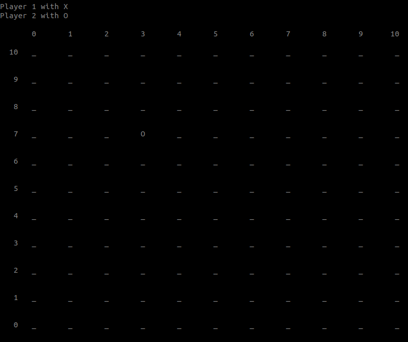
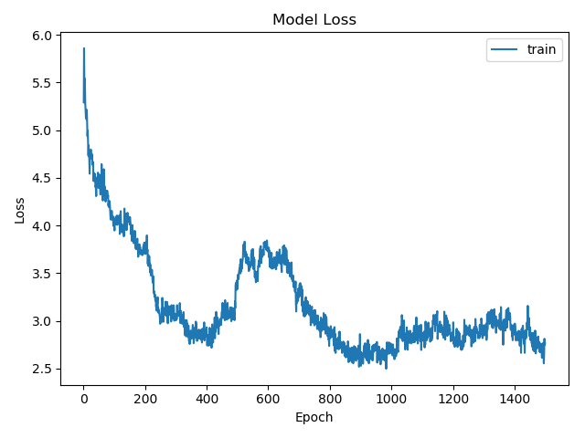
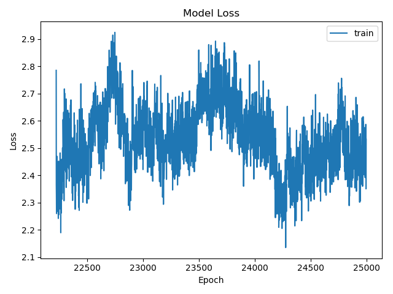

# Five in a row by using alpha zero

This is an implementation of AlphaZero algorithm for board 11 by 11 five in a row. 





## Requirement
**Library** | **Version**
--- | ---
**Python** | **^3.6.6**
**Keras** | **^2.2.2**
**Tensorflow** | **^1.10.0** 
**Numpy** | **^1.15.1**
**matplotlib** |  **^2.2.3**

## Introduction and Background

AlphaZero is a reinforcement learning algorithm that can master 5 in a row and other games by self-play without human knowledge.

### Self-play

#### Which model does AlphaZero keep  
In the AlphaZero, we always keep the newest model and self-play data is based on the current newest model. 
Using newest model yet not best model can make the self-play explore more, hence we can have higher possibility 
to get the global optimal rather than local optimal.

#### The way to make sure the data diversity
Moreover, to make the exploration more aggressive, we make the dirichlet noise smaller. The paper mentioned that the exploration is affected by the dirichlet noise after 30 steps when doing the self-play.

#### Always keep the first player self-play data

#### Optimizer

Five-in-a-row can be rotate and mirror, so we also keep the rotated and mirrored data of self-play to the data buff. In this way, we can reduce a lot computation.

### Policy Network

#### Board state

It's a 4 of 11 by 11 2-dimensional array. The first one is used to record the locations possessed by player 1. The second one is used to record the locations possessed by player 2. The third one is used to record the location of last move. The forth one is used to determine whether current player is the start player.

#### Model summary

```
__________________________________________________________________________________________________
Layer (type)                    Output Shape         Param #     Connected to                     
==================================================================================================
input_1 (InputLayer)            (None, 4, 11, 11)    0                                            
__________________________________________________________________________________________________
conv2d_1 (Conv2D)               (None, 32, 11, 11)   1184        input_1[0][0]                    
__________________________________________________________________________________________________
conv2d_2 (Conv2D)               (None, 64, 11, 11)   18496       conv2d_1[0][0]                   
__________________________________________________________________________________________________
conv2d_3 (Conv2D)               (None, 128, 11, 11)  73856       conv2d_2[0][0]                   
__________________________________________________________________________________________________
conv2d_5 (Conv2D)               (None, 2, 11, 11)    258         conv2d_3[0][0]                   
__________________________________________________________________________________________________
conv2d_4 (Conv2D)               (None, 4, 11, 11)    516         conv2d_3[0][0]                   
__________________________________________________________________________________________________
flatten_2 (Flatten)             (None, 242)          0           conv2d_5[0][0]                   
__________________________________________________________________________________________________
flatten_1 (Flatten)             (None, 484)          0           conv2d_4[0][0]                   
__________________________________________________________________________________________________
dense_2 (Dense)                 (None, 64)           15552       flatten_2[0][0]                  
__________________________________________________________________________________________________
dense_1 (Dense)                 (None, 121)          58685       flatten_1[0][0]                  
__________________________________________________________________________________________________
dense_3 (Dense)                 (None, 1)            65          dense_2[0][0]                    
==================================================================================================
Total params: 168,612
Trainable params: 168,612
Non-trainable params: 0
```

#### Training

Trained model vs pure MCTS AI

Initial pure MCTS simulates 2000 times. We evaluate our model every 500 self-play epochs by competing with the pure MCTS. If our model beat pure MCTS by 10:0, we keep current model as the best model and upgrade the pure MCTS by simulating 1000 more times util it hits 5000 simulation. 


## Training history

At the beginning, we trained a small one which was 6 by 6 four in a row. It took 4 hours HPC(High performance computing) to self-play 1500 rounds and generated a pretty good model.

Using the same method we tried to train a 11 by 11 five in a row model. It took 41 hours HPC to play 1500 rounds. But the model was not good, it only attacked but never defense.

Then we changed some parameters to improve the training. First, make MCTS search deeper. Second, train more times. Third, increase the number of simulations used for the pure mcts.

Then we output the training history. At the beginning it become stronger and stronger. The no-defense problem is solved.

We have trained the model 27518 epochs. According to the training history plot, it seems stuck in a local optimal.







Training outputs:

```
batch i:1, episode_len:67
kl:0.00464,lr_multiplier:1.500,loss:5.303383827209473,entropy:4.792854309082031,explained_var_old:0.015,explained_var_new:0.732
batch i:2, episode_len:47
kl:0.08788,lr_multiplier:1.000,loss:5.220064163208008,entropy:4.709277629852295,explained_var_old:0.730,explained_var_new:0.790
batch i:3, episode_len:38
kl:0.03463,lr_multiplier:1.000,loss:5.61008882522583,entropy:4.6324334144592285,explained_var_old:0.230,explained_var_new:0.215
...
batch i:27513, episode_len:15
kl:0.02130,lr_multiplier:0.667,loss:2.39105224609375,entropy:1.9589602947235107,explained_var_old:0.624,explained_var_new:0.740
batch i:27514, episode_len:19
kl:0.03058,lr_multiplier:0.667,loss:2.307953357696533,entropy:1.9487701654434204,explained_var_old:0.647,explained_var_new:0.745
batch i:27515, episode_len:17
kl:0.03779,lr_multiplier:0.667,loss:2.4055304527282715,entropy:1.9979723691940308,explained_var_old:0.633,explained_var_new:0.734
batch i:27516, episode_len:13
kl:0.02346,lr_multiplier:0.667,loss:2.3050026893615723,entropy:1.8730878829956055,explained_var_old:0.696,explained_var_new:0.795
batch i:27517, episode_len:21
kl:0.02487,lr_multiplier:0.667,loss:2.381922721862793,entropy:1.9453890323638916,explained_var_old:0.698,explained_var_new:0.775
```

## Training network

```sh
python3 train.py
```

### To play with our trained model
```sh
python3 human_play.py
```

## Plot

```sh
python3 plot.py
```

## License
[GNU General Public License v3.0](https://github.com/exelban/myo-armband-nn/blob/master/LICENSE)
